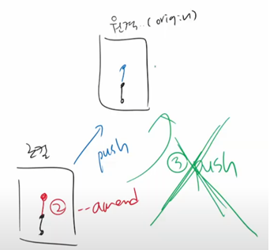

# 마크다운 문법
## 헤더
```
# H1
## H2
### H3
#### H4
##### H5
###### H6
```
## 인용문
> 이것이 `인용문`이다
```
>               인용1
>   >           인용2
>   >   >       인용3
```
## 목록
### 1. OrderedList(ol)
```
1. 첫번째
2. 두번째
3. 세번째
```
### 2. UnorderedList(ul)
```
* 점심메뉴
  * 햄버거
    * 패티
```
* 점심메뉴
  * 햄버거
    * 패티
## 코드블럭
```
' ``` '로 위아래를 감싼다!
```
```c
#include <stdio.h>
int main(void){
    printf('Hello World!');
    return 0;
}
```
## 문자수식
* 색강조 : `
* 기울임 : *
* 굵기 : **
* 수평선 : ***

## 표   
```
|제목|내용|설명|
|------|---|---|
|테스트1|테스트2|테스트3|
|테스트1|테스트2|테스트3|
|테스트1|테스트2|테스트3|
```
### <예시>
|과목|점수|등급|
|------|---|---|
|`국어`|100| 1|
|`수학`|100| 1|
|`영어`|100| 1|

> 표 그리는 사이트를 적극 활용하자   

## 파일/이미지 삽입
```
  이미지 삽입 : 
  파일 삽입   : [](파일_소스 경로)
  
* 절대경로 및 상대경로 참조에 주의한다
```
***

# CLI/GUI란
## 1. 개념
`CLI` (Command line interface) 또는 명령어 **인터페이스**는 가상 터미널 또는 텍스트 터미널을 통해 사용자와 컴퓨터가 상호 작용하는 방식을 뜻한다.   
`작업 명령` 은 사용자가 툴바 키보드 등을 통해 문자열의 형태로 입력하며, 컴퓨터로부터의 출력 역시 문자열의 형태로 주어진다.   
이 같은 **인터페이스**를 제공하는 프로그램을 명령 줄 `해석기` 또는 `셸`이라고 부른다.   
이를테면, 유닉스 셸(sh, ksh, csh, tcsh, bash 등)과 CP/M. 도스의 command.com이 있다.   
`GUI` (Graphic user interface)는 사용자가 편리하게 사용할 수 있도록 입출력 등의 기능을 알기 쉬운 아이콘 따위의 그래픽으로 나타낸 **인터페이스**이다   

## 2. [Git-Bash 사용예시]
폴더 내에서 마우스 우클릭, 'Git Bash here'   

　　　　　　
```
1. 폴더 내 파일 리스트; ls   
2. 폴더 생성; mkdir 파일이름   
3. 하위 폴더 입장; cd 파일이름   
4. 상위 폴더 회귀; cd ..     
5. 파일 만들기; touch 파일이름.확장명   
6. 삭제; rm 파일이름   
7. 폴더 삭제; rm -r 폴더이름
ls(list) mkdir(make directory) cd(change directory) .현재폴더 ..상위폴더 rm(remove), r(recursive;재귀)   
~(home) $(readysign)
```   


***
# 버전관리
## 의미
`버전관리`의 의미를 이해하고 `버전관리도구`에 대해 이해한다
일반적인 관리도구는 자료 간에 뭐가 바뀌었는지 차이(diff)를 알 수 없다.   
```
-중앙집중식버전관리시스템 : 로컬에서는 파일을 편집하고 서버에 반영중앙 서버에서만 버전을 관리   
-분산버전관리시스템` : 로컬에서도 버전을 기록하고 관리 원격 저장소를 활용하여 협업. GIT.
 ```
## GIT을 통한 버전관리 1
```
1. 작업을 하고(보고서 작성)
2. 변경된 파일을 모아서(add)
3. 저장을 한다 제출(commit -m)
```

## <예시>
````
폴더 생성 및 마우스 우클릭으로 VSCode 실행   
New terminal -> Git-Bash 실행 및 입력       
touch readme.md                                 readme.md 파일 생성
git init                                        git repository 설정
git config --global user.email "이메일"          git 이메일 설정
git config --global user.name "사용자이름"       git 사용자이름 설정
git add readme.md                               변경된 파일을 모은다
git add .                                       (폴더내 파일 한번에 모으기)
git commit -m readme.md                         제출한다
git status                                      상태를 본다
git log --all --oneline                         기록을 본다
````
## GIT을 통한 버전관리 2 
```
GIT 사용 시 주의사항   

1. 저장소의 이름 변경 -> O (.git이 git의 본체임)
2. .git폴더 삭제 -> X (버전이 모두 삭제됨)
3. 폴더를 다른 곳으로 이동(예, 바탕화면 --> C:/) -> △ ; 다른 git 저장소 폴더, 하위폴더면 안된다
```   

### `Git`은 `버전`을 관리한다 `GitHub` 원격저장소도 `버전`을 관리한다.   

```
Push는 로컬 저장소의 버전을 원격저장소로 보낸다(local repository -> remote repository)
Pull은 원격저장소의 버전을 로컬 저장소로 가져온다
```
```
원격 저장소 설정 및 버전 보내기   

git remote add origin <url>   ... 원격 저장소의 설정
git remote remove origin      ... 잘못 등록한 원격 저장소의 삭제
git push origin master        ... 로컬 저장소의 Committed 버전을 원격 저장소로 Push (commit된 버전만이 push 됨에 유의)
git remote -v                 ... 원격 저장소의 정보를 확인함

*** origin = global name of remote repository
    master = represents a branch
    Mine git url ex = https://github.com/VumVleV/TIL.git
```
```
원격 저장소로부터 받아오기 -1.

>>> git pull <원격저장소이름><브랜치이름>

다운로드(zip : 가장 최신 버전 상태의 파일만 받는 것 // clone: 저장소를 받아오는 것으로 모든 버전을 받음
  clone: 원격저장소 복제
   pull: 원격저장소 커밋 가져오기

따라서 프로젝트 시작 시 clone을 받아 온다. clone시 원격저장소 이름의 폴더가 생성됨에 유의
```
```
원격 저장소로부터 받아오기 -2.

git clone <url>                   ---원격 저장소 복제
git remote –v                     ---원격 저장소 정보 확인 (v, verbose)
git remote add <원격저장소><url>   ---원격저장소 추가(일반적으로 오리진)
git remote remove <원격저장소>         ---원격저장소 삭제 (만일 잘못 입력했을시 삭제한다)
git push <원격저장소><브랜치>       ---원격저장소에 push (권한 있을 시)
git pull <원격저장소><브랜치>       ---원격저장소로부터 pull

*** git clone의 경우 git init을 하지 않도록 주의한다
```
## GIT을 통한 버전관리 3 
### **중복 Branch**
```
(P)만일 동일 버전에 대해 여러 branch 경우 --> git이 merge conflict
(S)
1. 원격저장소의 커밋을 원격저장소로 pull,
2. 로컬에서 두 커밋을 병합(추가 커밋 발생) (merge conflict GIT으로 관리)
3. 다시 GitHub으로 push
```


### **.gitignore**
```
---버전관리랑 상관없는 파일 무시---

대상:
개발 언어관련(파이썬:venv/, 자바스크립트:node_momdules/), 
개발 환경관련(운영체제=windows,mac,linux) ex) .DS_Store: Thumb.db, desktop.ini 등(windows), 
텍스트에디터/IDE(visuaal studio code 등), 
secret.csv, *.pptx, 

콘솔로 .gitignore을 생성한다 (.gitignore만들 때 vscode에서 직접 만들자 / git 저장소마다 별도로 만들어줘야한다!)
.gitignore : git 파일/폴더 등을 관리하지 않는다 (.이름 -> 숨김파일 형식)
$ git status -> .gitignore을 확인할 수 있다

이미 커밋한 것
$ git status -> 무시하지 않음을 확인
이미 커밋된 것은 무시하지 않는다. 따라서 미리 .gitignore를 설정하자
커밋을 삭제하면 되겠지만 이는 Commit History를 변하게 하므로 지양한다
```
### **ignore 관련 유용한 사이트**   
**[gitignore.io](https://www.toptal.com/developers/gitignore/)**   
**[github/gitignore](https://github.com/github/gitignore)**

## GIT을 통한 버전관리 4
```
git branch                        --- 새로운 branch 생성
git checkout <branch>             --- 다른 branch로 이동
git status                        --- unstaged와 staged 확인
git log --oneline                 --- committed 확인 
git merge <branch>                --- branch 병합 (master에서; git checkout master)
  1587f6f (HEAD -> master, feature/main) Complete main page
  654ef20 Create README
git branch –d <branch>            --- branch 삭제
  Deleted branch feature/main (was 1587f6f)
git checkout –b feature/report    --- New branch로 이동
git log —oneline —graph           --- graph로 committed 확인
git restore —staged <file>        --- staged file 삭제
git restore README.md             --- 실수로 껐을 때 restore
git commit —ammend                --- committed된 것을 변경 --> commit history change 주의!!
```

```
협업의 진행상태

1. fast forward
2. merge – merge commit
3. merge – merge conflict   (git status -> you have unmerged paths)
  3-1. accept current changes
  3-2. accept incoming changes
  3-3. accept both changes
```
```
PR (Pull Request)
1. 마스터 브랜치는 반드시 배포 가능한 상태여야 한다
2. feature branch는 각 기능의 의도를 알 수 있도록 작성한다
3. Commit message는 매우 중요하며, 명확하게 작성한다
4. Pull Request를 통해 협업을 진행한다
5. 변경사항을 반영하고 싶다면, master branch에 병합한다 ...

1. SHARED Repository model
2. folk and pull model

Clone하고 싶은 GitHub 프로젝트에 가서 Fork로 내 원격저장소에 들인후 clone한다. 이후 내 원격저장소로 push후 PR하면 선택적으로 contribuition 할 수 있다.
```
